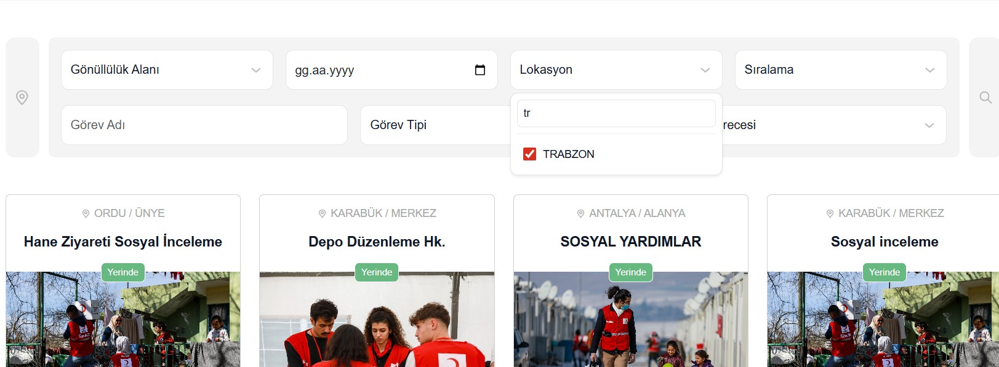

# BUG-001 – Location filter resets after navigating back from listing detail

## Summary
After selecting a location (Trabzon) and opening a volunteer listing, when navigating back to the listings page, the location filter still displays "Trabzon" as selected but listings from all cities are shown.

## Environment
- Website: Kızılay Gönüllü Ol
- Page: Gönüllülük Görevleri
- Browser: Chrome
- OS: Windows 10

## Preconditions
User is on the volunteer listings page.

## Steps to Reproduce
1. Navigate to the "Gönüllülük Görevleri" page.
2. Select location filter as "Trabzon".
3. Open any volunteer listing.
4. Use browser back button or site navigation to return to the listings page.

## Expected Result
Only volunteer listings from Trabzon should be displayed since the filter remains selected.

## Actual Result
Listings from all cities are displayed even though the UI shows Trabzon as selected.

## Screenshot

*Screenshot shows Trabzon selected while listings from multiple cities are displayed.*

## Video

## Observed Behavior
Location filter visually remains selected but backend result set appears unfiltered after navigation back action.

## Severity
Medium

## Priority
Medium

## Possible Impact
Users may assume they are viewing filtered results, leading to confusion and incorrect browsing decisions.

## Notes
This appears to be a state management or filter persistence issue.

⚠️ Note:
This report is created for portfolio and educational purposes only. No security vulnerability is involved.
