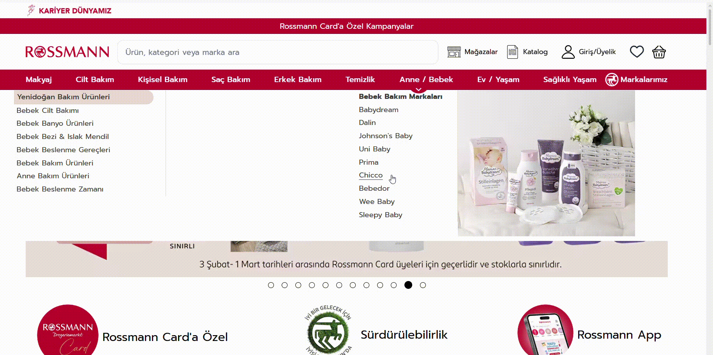

# BUG-002 – Bebedor Link Redirects to "Markalar" Page in Rossmann Anne/Bebek Category

## Summary
When clicking on the "Bebedor" link in the Anne/Bebek category, the user is redirected to the "Markalar" page instead of the Bebedor product listing.

## Environment
- Website: Rossmann
- Category: Anne/Bebek
- Browser: Chrome
- OS: Windows 10

## Preconditions
User is on the Rossmann website, in the "Anne/Bebek" category.

## Steps to Reproduce
1. Navigate to the Rossmann website.
2. Go to the "Anne/Bebek" category.
3. Click on the "Bebedor" link.
4. Observe that the page redirects to the "Markalar" page.

## Expected Result
The user should be taken to the "Bebedor" brand/product page.

## Actual Result
The user is redirected to the "Markalar" page instead of the "Bebedor" page.

## Video

## Severity
Medium

## Priority
Medium

## Possible Impact
Users may face confusion when trying to view products of a specific brand and may not be able to easily find what they're looking for.

## Notes
This seems to be a broken link or redirect issue in the navigation. 
⚠️ This bug report is created for portfolio and educational purposes only.

