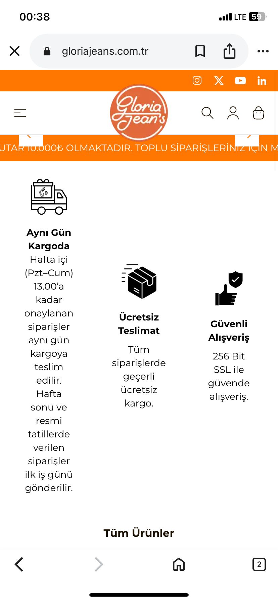

# BUG-003 – UI misalignment and excessive whitespace on homepage (mobile)

## Summary
On the homepage mobile view, service icons and their corresponding text descriptions are not properly aligned, and there is excessive empty whitespace below the section. This causes an unbalanced and visually inconsistent UI.

---

## Environment
- Website: Gloria Jeans Turkey
- Page: Homepage
- Device: Mobile (iPhone)
- Browser: Safari
- OS: iOS

---

## Steps to Reproduce
1. Open the Gloria Jeans homepage on a mobile device.
2. Tap on the **"Alışverişe Başla"** button.
3. Scroll down to the service information section (Same Day Shipping, Free Delivery, Secure Shopping).
4. Observe the alignment of icons and text.
5. Scroll further down toward the **"Tüm Ürünler"** section.

---

## Expected Result
- Icons and text should be vertically aligned consistently.
- Page sections should have balanced spacing without unnecessary empty areas.

---

## Actual Result
- Icons appear misaligned relative to their text descriptions.
- An excessive empty white space is displayed before the next content section.

---

## Screenshot

---

## Severity
Low

---

## Priority
Low

---

## Notes
This appears to be a responsive UI issue, likely caused by improper margin, padding, or flex/grid alignment settings in the mobile layout.

⚠️ *This bug report is created for portfolio and educational purposes only.*
